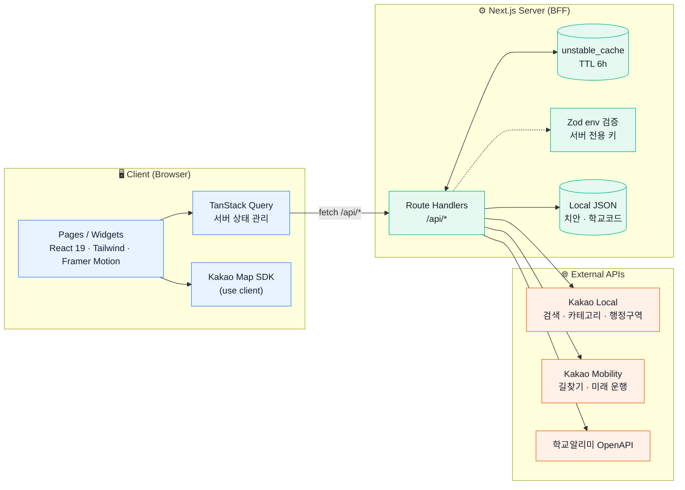
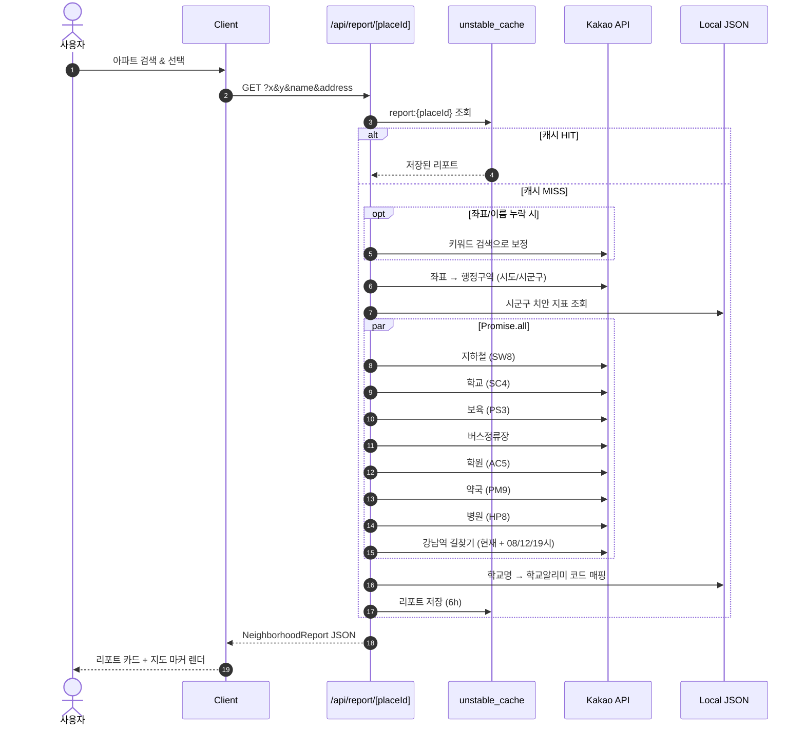
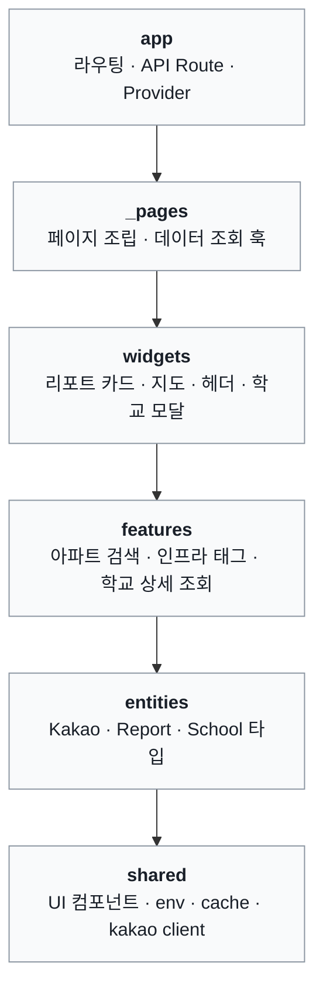

<div align="center">


# 핀 리포트 · dongne-report

**"이 아파트, 살기 어때?"** 에 한 화면으로 답하는 생활권 리포트 서비스

아파트를 검색하면 치안 · 교통 · 보육 · 학교 · 학원 · 의료 정보를 모아서
지도 위에 한 번에 보여줍니다.

<br />


<br />


</div>

<br />

## 📑 목차

- [만들게 된 계기](#-만들게-된-계기)
- [프로젝트 소개](#-프로젝트-소개)
- [주요 기능](#-주요-기능)
- [아키텍처](#-아키텍처)
- [리포트 생성 흐름](#-리포트-생성-흐름)
- [폴더 구조 (FSD)](#-폴더-구조-fsd)
- [기술적 고민](#-기술적-고민)
- [API 명세](#-api-명세)
- [시작하기](#-시작하기)
- [데이터 출처](#-데이터-출처)

<br />

## 💡 만들게 된 계기

> 집을 알아볼 때, 정작 궁금한 건 **"그 동네에서 살면 어떤가"** 였습니다.

실거래가는 부동산 앱에서 쉽게 볼 수 있지만,

- 근처에 **어린이집**은 몇 개나 있는지
- **지하철역**까지 걸어갈 수 있는지, **출근 시간에 강남까지** 차로 얼마나 걸리는지
- 배정될 만한 **학교**는 어디고, 학생 수나 학급 수는 어떤지
- 이 지역 **치안**은 괜찮은지

이런 정보는 지도 앱, 학교알리미, 공공데이터 사이트를 하나하나 오가며 직접 찾아야 했습니다.
흩어져 있는 생활권 정보를 **아파트 이름 하나로 모아 보여주면 좋겠다**는 생각에서 핀 리포트를 시작했습니다.

<br />

## 🏠 프로젝트 소개

| 항목 | 내용 |
| --- | --- |
| 서비스명 | 핀 리포트 (dongne-report) |
| 한 줄 소개 | 아파트 · 오피스텔 위치 기준 생활권 종합 리포트 |
| 개발 기간 | 2026.03 ~ 진행 중 |
| 개발 인원 | 1인 (기획 · 디자인 · 프론트엔드 · BFF) |
| 주요 사용자 | 이사 · 청약 · 매매를 고민하는 사람, 특히 아이를 키우는 가정 |

<!--
📸 스크린샷을 추가하면 훨씬 보기 좋아져요!
docs/images/ 폴더에 이미지를 넣고 아래 주석을 해제하세요.

<div align="center">
  
  
  
</div>
-->

<br />

## ✨ 주요 기능

### 🔍 아파트 검색

- Headless UI Combobox 기반 자동완성 검색
- 300ms 디바운스로 불필요한 API 호출 최소화

### 📋 생활권 리포트

| | 카테고리 | 반경 | 제공 정보 |
| :---: | --- | :---: | --- |
| 🚨 | **치안** | 시군구 | 인구 10만 명당 범죄 발생률 + 전국 분포 기반 등급 |
| 👶 | **보육** | 1km | 어린이집 · 유치원 개수, 가까운 Top 5 |
| 🚇 | **교통** | 1km | 지하철역 Top 3, 버스정류장 개수 · Top 5 |
| 🚗 | **자차 이동** | → 강남역 | 지금 / 08시 / 12시 / 19시 출발 소요시간, 경유 IC, 택시비 · 통행료 |
| 🏥 | **의료** | 1km | 병원(피부과 · 성형외과 등 제외 필터링) · 약국 Top 10 |
| 📚 | **학원** | 1km | 주변 학원 개수 및 목록 |
| 🏫 | **학교** | 1.5km | 주변 학교 Top 10 + 학교알리미 코드 매핑 |

### 🏫 학교 상세 정보 (학교알리미 연동)

학교를 선택하면 학교알리미 OpenAPI를 병렬로 조회해 모달로 보여줍니다.

`기본정보` `수업일수·시수` `학교 현황` `성별 학생수` `학년별 학급·학생수` `학교폭력 예방교육` `입학생 현황` `교복 구매 유형·단가`

### 🗺️ 인프라 태그 × 지도 마커

- 보육 · 교통 · 병원 · 학원 · 학교 태그를 누르면 해당 시설이 카카오맵 마커로 표시
- Framer Motion 기반의 부드러운 카드 등장 애니메이션

<br />

## 🏗 아키텍처

클라이언트는 외부 API를 직접 호출하지 않고 **Next.js Route Handler(BFF)** 만 호출합니다.
API 키는 서버에만 존재하고, 외부 응답은 서버에서 가공 · 캐싱한 뒤 내려줍니다.



<br />

## 🔄 리포트 생성 흐름

`/api/report/[placeId]` 한 번의 요청으로 8개의 외부 호출을 **병렬 처리**하고, 결과를 하나의 리포트로 합칩니다.



<br />

## 📂 폴더 구조 (FSD)

[Feature-Sliced Design](https://feature-sliced.design/)을 참고해 레이어별 책임을 나눴습니다.
상위 레이어는 하위 레이어만 참조할 수 있습니다.



<details>
<summary><b>📁 전체 디렉토리 펼쳐보기</b></summary>

```txt
src/
├── app/
│   ├── page.tsx                       # 메인 (검색)
│   ├── apt/[placeId]/page.tsx         # 상세 리포트
│   ├── about/page.tsx
│   └── api/
│       ├── kakao/
│       │   ├── search/route.ts        # 키워드 검색
│       │   ├── category/route.ts      # 카테고리 검색
│       │   └── coord2region/route.ts  # 좌표 → 행정구역
│       ├── report/[placeId]/route.ts  # 종합 리포트
│       └── schoolinfo/                # 학교알리미 프록시 + 응답 필터링
├── _pages/
│   ├── map/ui/MapSearchPage.tsx
│   └── apt/
│       ├── ui/                        # Page · Content · Loading · Error
│       ├── hooks/useReportSection.ts
│       └── model/useNeighborhoodReport.ts
├── widgets/
│   ├── apt-summary/                   # 요약 카드 + 미니맵
│   ├── report-sections/               # 치안 · 교통 · 보육 · 의료 · 학원 · 학교 카드
│   ├── school-detail/                 # 학교 상세 모달 (apiType별 렌더러)
│   ├── kakao-map/
│   └── header/
├── features/
│   ├── search-apt/                    # Combobox 검색
│   ├── apt-infra/                     # 인프라 태그 · 마커 매핑
│   └── school-details/                # 학교 상세 조회 훅
├── entities/
│   ├── kakao/  report/  school/       # 도메인 타입
└── shared/
    ├── config/env.ts                  # Zod 환경변수 검증
    ├── lib/                           # kakao · cache · report-data · normalize
    └── ui/                            # card · badge · input · skeleton
```

</details>

<br />

## 🧠 기술적 고민

<details>
<summary><b>1. API 키를 클라이언트에 노출하지 않으려면?</b></summary>

<br />

- 외부 REST 호출은 모두 `app/api/*` Route Handler에서만 수행하는 **BFF 구조**로 설계했습니다.
- 클라이언트에 공개되는 키는 지도 렌더링용 `NEXT_PUBLIC_KAKAO_MAP_KEY` 하나뿐입니다.
- `KAKAO_REST_API_KEY`, `SCHOOLINFO_API_KEY`는 Zod로 서버 시작 시점에 검증합니다.

</details>

<details>
<summary><b>2. 리포트 한 번에 외부 API가 10번 넘게 호출되는 문제</b></summary>

<br />

- 서로 의존성이 없는 카테고리 검색 · 길찾기 요청을 `Promise.all`로 **병렬 처리**해 응답 시간을 줄였습니다.
- `unstable_cache`로 키워드 검색 · 카테고리 검색 · 행정구역 · 리포트 전체를 **6시간 캐싱**해 쿼터 소모와 지연을 줄였습니다.
- 동네 인프라는 자주 바뀌지 않는 데이터라 6시간 TTL이 적절하다고 판단했습니다.

</details>

<details>
<summary><b>3. 카카오 학교 데이터와 학교알리미 데이터 연결하기</b></summary>

<br />

- 카카오 장소 검색 결과에는 학교알리미의 학교 코드가 없습니다.
- 학교명 + 시군구 + 도로명 주소를 기준으로 `school-codes-index.json`에서 코드를 찾는 **매핑 로직**을 만들었습니다.
- 지역 suffix(예: `서울` → `서울특별시`) 정규화, 학교명으로부터 학교급 코드 추론 등을 통해 매칭률을 높였습니다.
- 학교알리미 응답은 지역 단위로 내려오기 때문에, 서버에서 해당 학교 단건만 필터링해 전달합니다.

</details>

<details>
<summary><b>4. 출퇴근 시간대별 이동 시간 계산</b></summary>

<br />

- 카카오모빌리티 **미래 운행 정보 API**로 다음 08:00 / 12:00 / 19:00(KST) 출발 기준 소요시간을 조회합니다.
- 경로 가이드에서 IC를 추출 · 중복 제거해 주요 경유지를 보여줍니다.
- 일부 시간대 조회가 실패해도 전체 리포트는 깨지지 않도록 개별 `try/catch`로 격리했습니다.

</details>

<br />

## 📡 API 명세

| Method | Endpoint | 설명 |
| :---: | --- | --- |
| `GET` | `/api/kakao/search?query=` | 아파트 · 오피스텔 키워드 검색 |
| `GET` | `/api/kakao/category?category_group_code=&x=&y=&radius=` | 카테고리 기반 주변 시설 검색 |
| `GET` | `/api/kakao/coord2region?x=&y=` | 좌표 → 행정구역 변환 |
| `GET` | `/api/report/[placeId]?x=&y=&name=&address=` | 생활권 종합 리포트 |
| `GET` | `/api/schoolinfo?schoolCode=&schoolName=&address=&apiType=` | 학교알리미 단일 항목 조회 |
| `GET` | `/api/schoolinfo?schoolCode=&schoolName=&address=&all=1` | 학교알리미 전체 항목 병렬 조회 |

<br />

## 🚀 시작하기

### 요구 사항

- Node.js 18+
- pnpm

### 설치 & 실행

```bash
git clone https://github.com/kyungchan3007/dongne-report.git
cd dongne-report
pnpm install
```

`.env.local` 파일을 만들고 아래 값을 채워주세요.

```env
NEXT_PUBLIC_KAKAO_MAP_KEY=   # Kakao JavaScript 키 (지도)
KAKAO_REST_API_KEY=          # Kakao REST API 키 (Local · Mobility)
SCHOOLINFO_API_KEY=          # 학교알리미 OpenAPI 키
SCHOOLINFO_BASE_URL=http://www.schoolinfo.go.kr/openApi.do
```

```bash
pnpm dev
```

→ http://localhost:3000

<br />

## 📊 데이터 출처

| 데이터 | 출처 |
| --- | --- |
| 장소 검색 · 주변 시설 · 행정구역 | [Kakao Local API](https://developers.kakao.com/docs/latest/ko/local/dev-guide) |
| 자동차 길찾기 · 미래 운행 정보 | [Kakao Mobility API](https://developers.kakaomobility.com/) |
| 학교 상세 정보 | [학교알리미 OpenAPI](https://www.schoolinfo.go.kr/) |
| 시군구 치안 지표 | `public/data/safety-sigungu-per100k-250.json` |
| 학교 코드 인덱스 | `public/data/school-codes-index.json` |

> ⚠️ 치안 등급은 전국 시군구 분포를 3분위로 구간화한 **정적 지표**입니다.
> 실시간 사건 · 사고를 반영하지 않으므로 참고용으로만 활용해주세요.

<br />

<div align="center">

**Made with ☕ by [kyungchan3007](https://github.com/kyungchan3007)**

</div>
